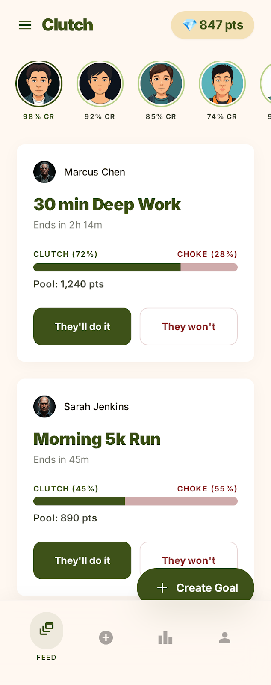
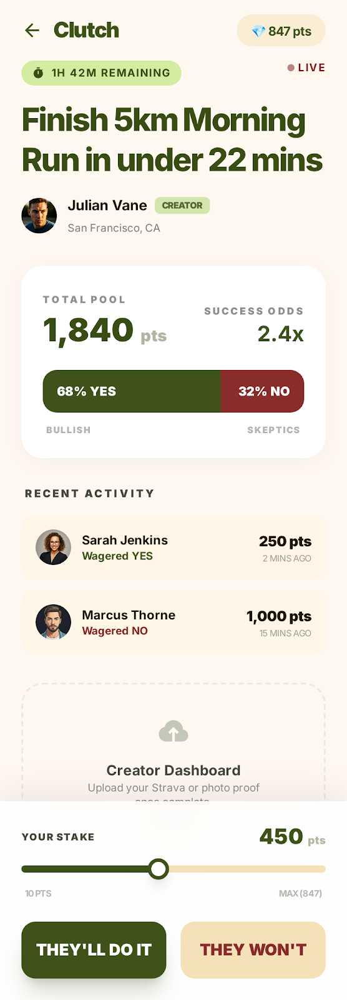
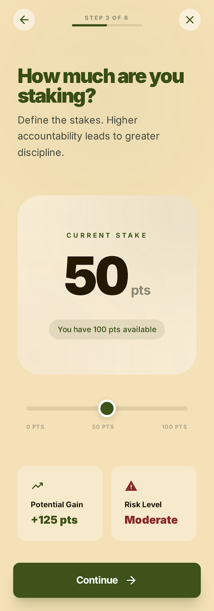
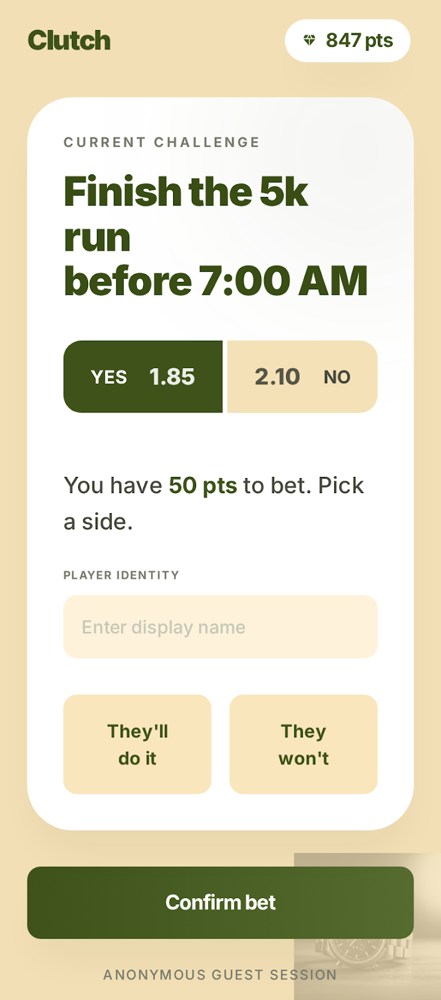
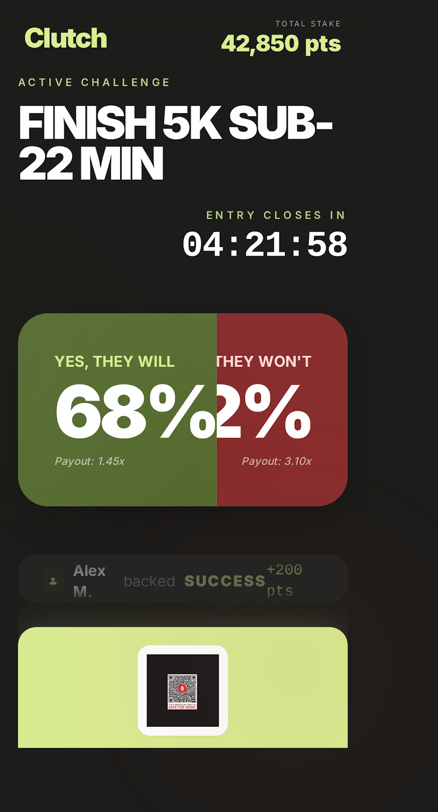
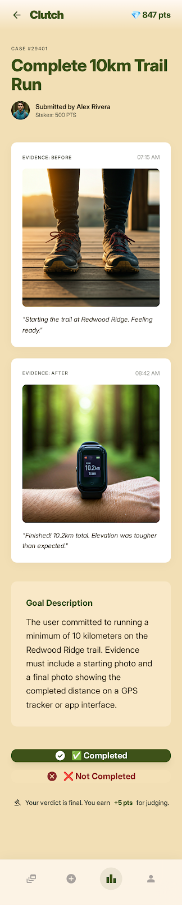
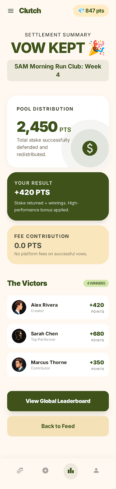
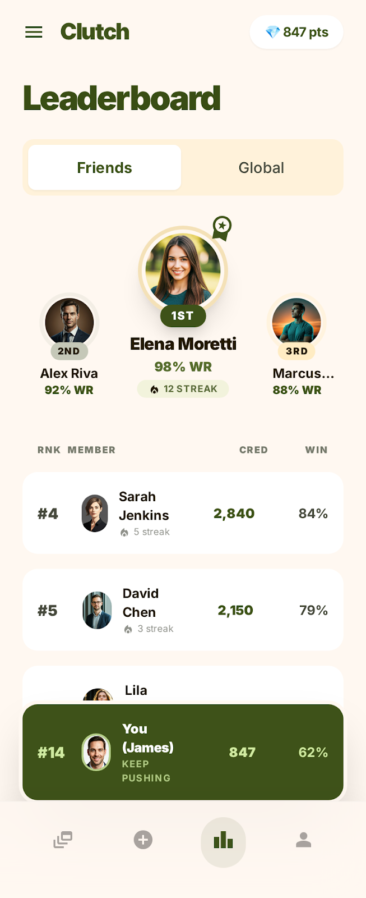

# Clutch

**Points-based social accountability. Stake your credibility. Let friends bet on whether you'll deliver.**

[Live Demo](https://app-b1j7mqtf8rgh.appmedo.com) · [Landing Page](https://clutchbymedo.framer.website)

Built at **NUS Ship It Hackathon, April 2026**.

---

## The Idea

Clutch turns personal goals into public stakes. No real money — your reputation is on the line.

**The loop:**
1. Create a goal. Stake your points, set a deadline, capture "before" evidence, designate a Judge.
2. Share the goal link. Friends (or a live room) scan a QR code and bet on success or failure.
3. The odds bar shifts in real time as bets come in.
4. At the deadline, you submit evidence. The Judge sees before/after side by side and gives a verdict.
5. Points redistribute — winners split the losers' pool.

**Vocabulary:**
- **CLUTCH** = backing success (believers)
- **CHOKE** = backing failure (doubters)
- **Credibility Score** = `floor(points × win_rate × (1 + 0.1 × streak))`

The full loop plays out in under 5 minutes with a live audience. The demo use case: a pushups goal, audience scans QR from a projected screen, bets in real time, odds shift live.

---

## Screens

<table>
<tr>
<td align="center"><br/><sub>Feed</sub></td>
<td align="center"><br/><sub>Goal Detail + Betting</sub></td>
<td align="center"><br/><sub>Stake Step</sub></td>
<td align="center"><br/><sub>Guest Landing (QR scan)</sub></td>
</tr>
<tr>
<td align="center"><br/><sub>Live View (fullscreen)</sub></td>
<td align="center"><br/><sub>Judge View</sub></td>
<td align="center"><br/><sub>Settlement</sub></td>
<td align="center"><br/><sub>Leaderboard</sub></td>
</tr>
</table>

---

## Architecture

```
React + Tailwind + Vite (Medo output)
  ↕ Supabase — database, auth, realtime subscriptions
  ↕ react-qr-code — QR generation for live audience onboarding
  ↕ react-router-dom — routing
```

**Database schema:**

| Table | Key Fields |
|-------|-----------|
| `profiles` | id, display\_name, points\_balance (default 100), goals\_attempted, goals\_completed, current\_streak, is\_guest |
| `goals` | id, creator\_id, title, deadline, stake\_amount, status, before\_evidence, after\_evidence |
| `bets` | id, goal\_id, user\_id, side ('success'\|'failure'), amount. UNIQUE(goal\_id, user\_id) |
| `judges` | id, goal\_id, judge\_user\_id, verdict, invite\_token |
| `transactions` | id, user\_id, goal\_id, amount, reason |

**Settlement logic:**
- Verdict = completed: each success backer gets `bet + floor((bet/successPool) × failurePool)`. Creator gets stake back.
- Verdict = not completed: `loserPool = stake + successPool`. Each failure backer gets `bet + floor((bet/failurePool) × loserPool)`.
- Judge always earns +5 pts flat.

---

## Screens Reference

| Route | Screen |
|-------|--------|
| `/` | Feed — live goals with CLUTCH/CHOKE odds bars, 3s polling |
| `/create` | Goal creation — 5 steps: name, deadline, stake, evidence, judge + share |
| `/goal/:id` | Goal detail — betting interface, live activity feed |
| `/goal/:id/present` | Live View — fullscreen, dark olive, QR code for audience |
| `/goal/:id/judge?token=xxx` | Judge view — before/after evidence, verdict buttons |
| `/goal/:id/result` | Settlement — payout breakdown, victors list |
| `/profile` | Profile — credibility score, win rate, streak, history |
| `/leaderboard` | Leaderboard — podium top 3, full ranked list, pinned current user |

---

> This repo contains the design spec and prototype. The app was built on Medo (a no-code builder); source code lives on the platform.
